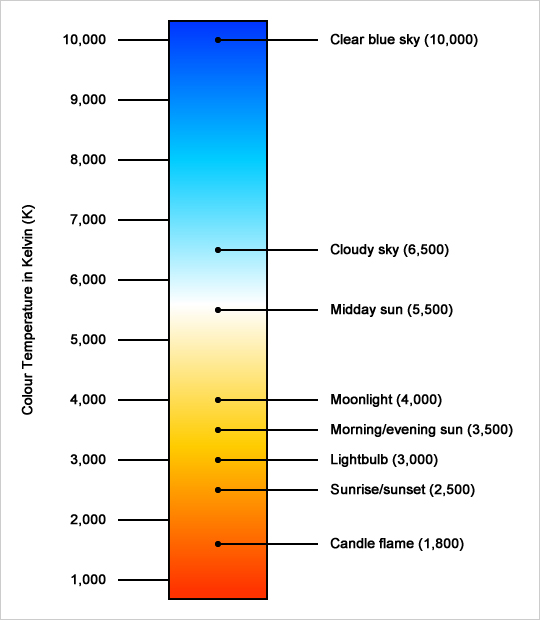
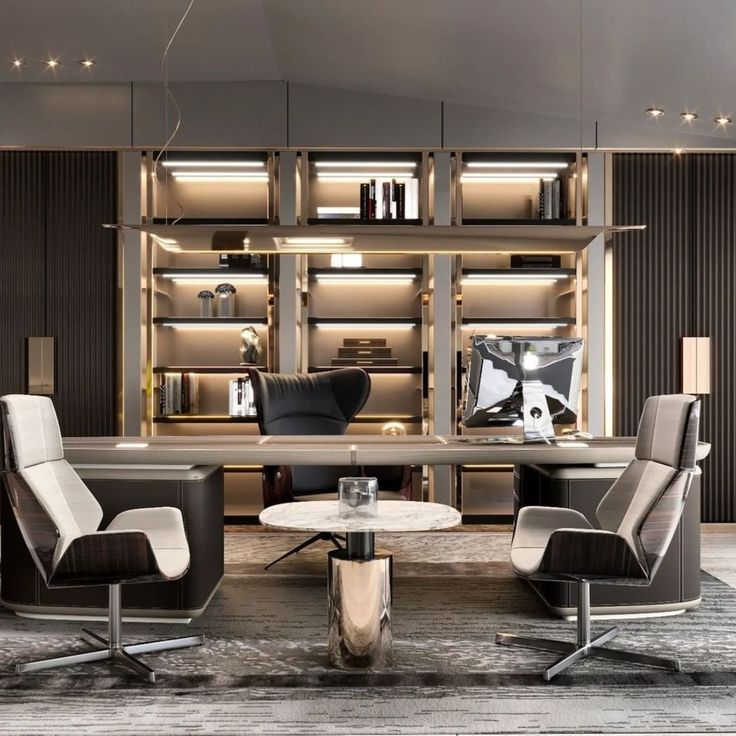
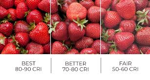
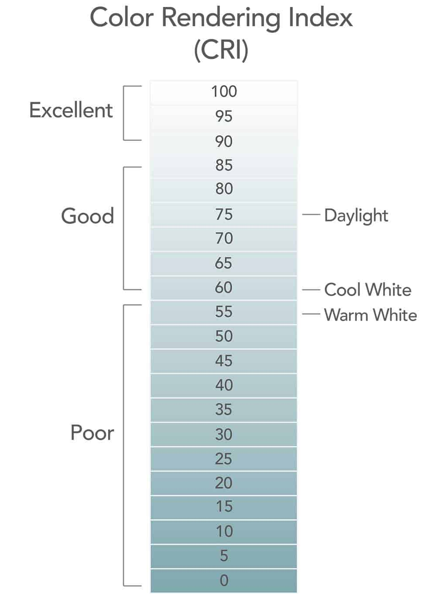

# Understanding Color Temperature (CCT) & Color Rendering Index (CRI)

---

# What is CCT?

- **CCT** = Correlated Color Temperature  
- Measured in **Kelvin (K)**  
- Describes the appearance of white light:
  - 2700K = Warm (yellowish)
  - 4000K = Neutral white
  - 6500K = Cool (bluish white)

*Image: Kelvin scale chart*

---

# Kelvin Scale Illustration

- Shows range from candlelight to daylight

---

# CCT in Real Spaces

- **Warm (2700K)**: Home, cafes  
- **Neutral (4000K)**: Offices, shops  
- **Cool (6500K)**: Hospitals, labs

  
  

---

# What is CRI?

- **CRI** = Color Rendering Index  
- Scale: 0 to 100  
- Measures light's ability to reveal accurate colors  
- High CRI (>90): True, vibrant colors

---

# CRI Example

- Compare fruits under CRI 70 vs CRI 95

---

# Real-World Applications

- Museums, retail stores need high CRI  
- Warehouses, factories may accept lower CRI

---

# CCT vs CRI Comparison Table

| Feature    | CCT                       | CRI                            |
| ---------- | ------------------------- | ------------------------------ |
| Definition | Color tone of white light | Accuracy of color rendering    |
| Unit       | Kelvin (K)                | Index (0–100)                  |
| Affects    | Mood, appearance          | Visual clarity, color fidelity |

---

# Choosing the Right CCT

- Warm white (2700K–3000K): Relaxation  
- Neutral white (3500K–4100K): Focus  
- Cool white (5000K–6500K): Alertness

---

# Choosing the Right CRI

- CRI > 90: Ideal for photography, fashion  
- CRI 80–90: Good for general use  
- CRI < 80: Risk of color distortion

---

# Practical Scenarios

- **Office:** 4000K, CRI > 80  
- **Studio:** 5000K+, CRI > 95  
- **Retail:** 3000–4000K, CRI > 90

---

# Reading CCT & CRI in Datasheets

- CCT listed in Kelvin  
- CRI may appear as Ra or CRI80/CRI90  
- Check both values before selection

---

# CT vs CCT – The Real Difference

| Term        | CT – Color Temperature                                 | CCT – Correlated Color Temperature                     |
|-------------|--------------------------------------------------------|--------------------------------------------------------|
| Meaning     | Theoretical color temperature of blackbody radiation  | Perceived color temperature of real-world light sources |
| Source      | Ideal blackbody radiator (physics-based)              | LEDs, fluorescents, etc.                               |
| Used In     | Physics calculations, simulations                     | Lighting design and product specifications             |
| Unit        | Kelvin (K)                                             | Kelvin (K)                                             |

---

# What Affects CCT & CRI Output?

1. **LED Type & Phosphor Mix** – Determines base spectrum  
2. **Driver Current** – High currents may shift color output  
3. **Optics & Lenses** – Can slightly affect perception  
4. **Heat & Aging** – Long-term drift in both CCT and CRI  
5. **Dimming Technology** – Some systems shift to warmer tones when dimmed  
6. **CRI Target in Design** – Engineered for 80, 90, or 95+ based on phosphor

---

# How to Adjust CCT and CRI

### To change CCT:

- **Change LED Type:** Choose a different Kelvin-rated LED  
- **Phosphor Composition:** More yellow phosphor = warmer CCT  
- **Dimming Circuit:** Tunable white drivers can shift CCT when dimmed  
- **Optics/Filters:** Influences perception, not true CCT

### To change CRI:

- **Use Higher Quality LEDs:** Better spectral coverage (especially red R9)  
- **Phosphor Quality:** Specialized phosphors enhance color fidelity  
- ❗ Cannot be adjusted electronically or optically — must change the LED

---

# Summary Table

| Change Factor          | Affects CCT     | Affects CRI | Electronically Adjustable? |
| ---------------------- | --------------- | ----------- | -------------------------- |
| LED Type               | ✅               | ✅           | ❌                          |
| Phosphor Composition   | ✅               | ✅           | ❌                          |
| Driver Current/Dimming | ✅ (partly)      | ❌           | ✅ (CCT only)               |
| Optics/Filters         | 👁️ (perceived) | ❌           | ❌                          |
| LED Design Target      | ❌               | ✅           | ❌                          |

---

# Summary

- CCT: Controls mood, ambiance  
- CRI: Ensures accurate color reproduction  
- Choosing the right light = Balanced CCT + CRI

---

# Thank You / Questions?
If you have any questions or need further clarification, please don't hesitate to ask! 😊